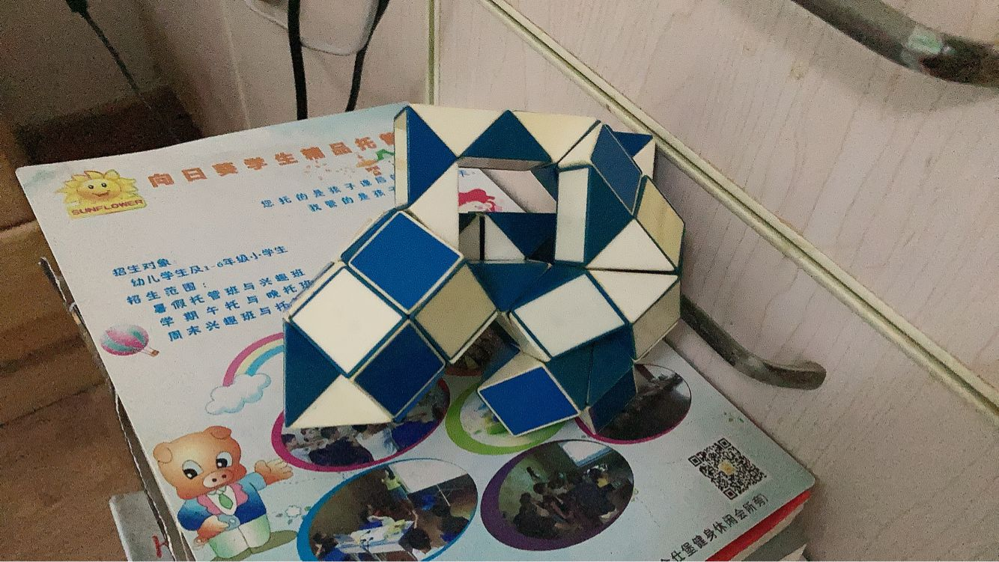
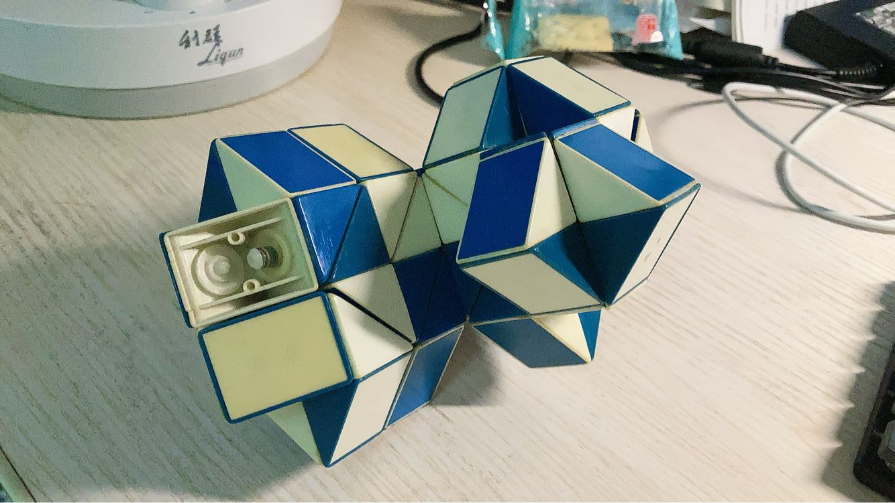

甲辰年 癸酉月 辛卯日

溧阳 多云

清晨梦见制作人脑花的自动化机器。

早饭回顾五学meme。“我作为总统的实力是无限的”、“国家怎么成了这个样子”、“不能再犹豫了，一定要出重拳”。然而光州事件却推动了韩的民主化进程，相比之下天朝的那件事至今仍是不能碰的滑梯，我这代人知道的都不多了吧，李佳琦蛋糕事件就可以看出来了。

母告诉我，酸菜鱼奶奶因为吃鳜鱼，刺卡住，去溧阳两家医院无果，只能南京。

上午，把昨天的lc每日一发快速补了，今天的每日做过没意思。看了点 ppo. 22 年做毕设，策略梯度定理直接跳过没学，该还债了。

摆烂时间搜了魔尺吧，三千关注，都没活人了，玩魔尺的还是太少了。给狗女人吧签了个到，“今天你第一个签到”，没绷住。

堂哥带堂侄女来小店，父推荐魔尺，叫堂哥亲身示范，然而他怎么可能会玩。最后拿了个棱锥魔方走了。想起来还是小学时放暑假，午睡睡不着，把玩很久发现了局部的球状结构形式，组合起来就有了各式各样的整体了，做出了乌龟，标志性的一步，记忆犹新，之后的海胆、大球、奖杯、陨石等，本质没有区别。后来又发现了类似的锥状局部形式。

岚给我发铃兰 r18 图。

中午腿上打A，太滑，等天冷一点再来吧家人们。

下午本打算补策略梯度，但前置知识又模糊了，王的 drl 书再来一遍。

用了指数函数的softmax，奇妙地用了凹凸性，和 risk-sensitive rl 里的 Exponential Reward 想法一样。凑点别的或许能水一期指数函数视频，贝叶斯里指数函数也依托。

想学的太多，学不过来喽。

偶遇lc 1500分的中科人，果然啥学校都有飞舞，可见好的流年大运对人生影响多大。上交狗女人，组队的两个，cmu软件硕，Amazon实习生，gitignore不用，ds store文件扔git，生怕别人不知道他是mac用户，提个issue就搁那破防，给人笑嘻了。18 年秋还嘲笑我约瑟夫环模拟写了半天，现在我看你水平也不行啊。最近才知道狗女人少数民族加分才进的上交，她格入土金伤官，纯纯因为戌年冲辰，折木生金，才能幸运。我加分我也能上交，天朝拼爹拼娘的一刀切狗屎政策我不好说。

无论是名人，还是身边的例子，无不说明学历只是一纸空文而已，学历和实力、智力、事业没有关系。以前认为碰碰车含辛茹苦复读一年去中科大是非常值得的，但现在看来，需要打上问号了。

更何况，现在初高中教育完全以分数为唯一标准，与因材施教背道而驰。每个人的天赋智力都是天生的，给不是读书材料的孩子灌输知识只会害了他。子曰：“不知命，无以为君子也。” 我未来若有孩子，希望能拒绝老师的洗脑，因材施教，给他幸福快乐。

~~想起来高中做英语周末卷，完形填空参考了周和史的答案，结果比他俩都高，我就觉得离谱。足可见单一答案的不合理。~~

“天雨虽宽不润无根之草，佛法虽广不度无缘之人”。车大飞跃群，曾有phd candidate口出狂言，亵渎命学，操作数问我何不与之辩论。无数的经历告诉我，和低智、无缘的人说再多也无益，他们不是这块材料，和这种人争论只会白白浪费时间。

摆烂时间玩魔尺，拧了一个二乘二的锥状结构和半个二乘一的球状结构，竟然还能首尾相接。是不是该花点时间研究一套类似有机化学的命名法则了。

晚上 torch 看到 creation ops 结束。A Visual Introduction to Differential Forms 看了点，鉴定为略低于 GRE 的阅读材料，非常合我的胃口。

Putting all of these pedagogical strategies together may result in an exposition that, to an expert, would seem at times to be unnecessarily long, but this book is based on my own experiences and reflections in both learning and teaching and is entirely written with students fairly new to mathematics in mind. I want my readers to truly understand and internalize these ideas, to gain a deeper and more accurate perception of mathematics, and to see the beautiful interconnectedness of the subject; I want my readers to walk away feeling that they have genuinely mastered a body of knowledge and not simply learned a set of disconnected facts.

国内写教材的教书的听到没有，点名批评，到处空降概念公式，我以前就被害惨了。

第一章我怎么看过一部分了，都忘了什么时候看的了，一查板子竟然是今年二三月份地铁看的。

本来打算只言片语，结果又写了这么多，笑死。有时间抽空补一下五学老番。22 年去家乡话家玩，快四年未见，我看他面相说他中年会发财，他指着全斗焕演员叫我看。当时没懂，今天翻 wiki 看到真有全斗焕看面相的剧情，发消息，竟然上班也间歇性摸鱼。

---

花絮，逆天gpt，可见只是对人类拙劣的模仿罢了，什么时候才能 AGI.

