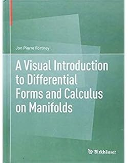
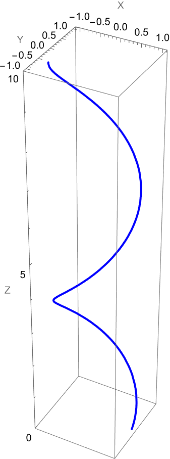

甲辰年 癸酉月 壬辰日

溧阳 多云到阴

今天金水好旺，希望心脏没事。

每日有点意思。2306，题号和难度分差不多。先想了按后缀分组，组内不行，但还是 n 方。想到按首字母，把分组分成含和不含两类，但对称性难判断。于是想到枚举首字母对，统计组数量就行了。思考时间约 15 分钟。

```cpp
unordered_map<string, unordered_set<char>> suffix_to_first
```
sb lc 经典卡常，`unordered` 低人一等，换 python 过了。

母闺蜜赵，女儿即将结婚，对我说男方情况云云。然现在离婚率达五成，六合临死门，癸加己为华盖地户，男女音信皆阻。乙庚同宫，但地盘临丁，为第三者插足。断其必离，母不信。古人之言灵验否，不妨拭目以待。

中午看了点玄学，看了点上证，看了点微分几何。两个月时间考 G 害怕来不及，懒了还是算了吧。

未时帮忙给厨房装塑料门。

操作数改用 `string_view` 加 mask 过了。学到许多。



学爽了，吹爆这本，无需多言。

晚饭看了点五共。人太多了，抽空补点背景。

过敏性鼻炎，打喷嚏太响，被回家的老妈楼下听到，撵下去跳绳，跳了一百个再起不能。以前双跳能十几个不断，现在一个都不会了。某一次尝试，没注意脚后跟着地，内脏都震得疼（夸张一下）吃完饭没多久加太瘦导致的。

晚上看点 np 和 torch. Boolean Indexing.

竟然每次回家拉肚子。

老电脑重装系统之后 mma 还没，整一个。狗女人戊戌年群里问啥软件画图，还被我抢答了，笑死。

14.1 激活码没个能用的，换回 13.3 了。

```
ParametricPlot3D[
    {Cos[t], Sin[t], t}, {t, 0, 10 Pi}, 
    PlotStyle -> Directive[Thick, Blue], 
    AxesLabel -> {"X", "Y", "Z"}, 
    PlotRange -> {All, All, {0, 10}}
]
```



每日扔到 Q3Q4 题解里。progress 的脚本还写死了总题目数量，该写个爬虫了，明天再来吧家人们。