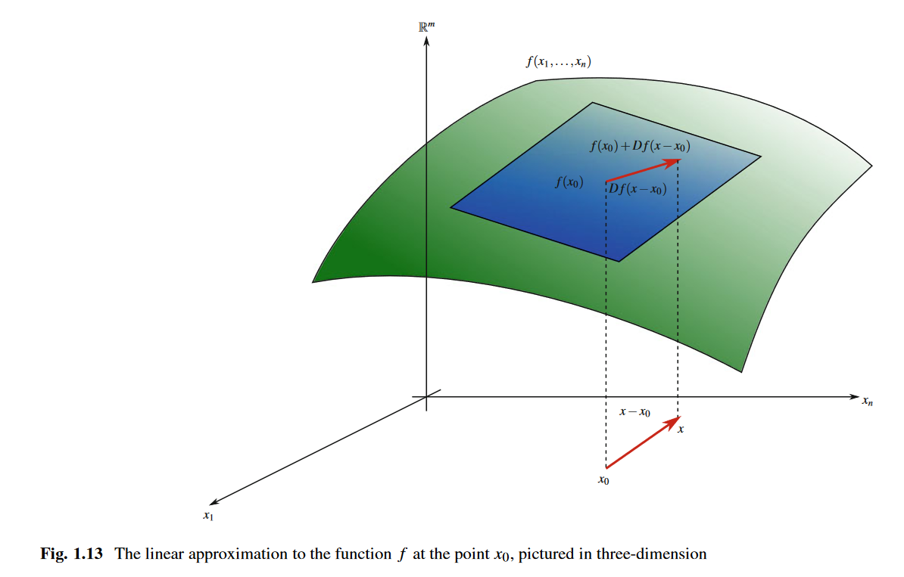

甲辰年 甲戌月 丁未日

多云到晴

国区 ez. 美区题号 962，1608 分的 T2. 一眼线段树，然后想到操作数经典操作，对下标排序之后扫描值域，再用个数据结构维护。想到 set 可以，但只需要最小值，直接变量记就行了。没注意相等元素的顺序，以为不影响答案，WA 1.

怎么还能单调栈，双向妙的。

lc 讨论区没眼看，八八六。

看微分几何。

牛逼牛逼牛逼！

矩阵求导看完了。

涨粉挺多，但全是收藏没人看，绝绝子。

蘑菇催我学代数。

看了点玄学。毕啸天果然是癸水日主，但喜用不明，知识盲区了。估计还是用火，甲午获博士，亥子年辗转生火，大红。

lc 国区的加强版怎么不会做，晚上累了脑子又坏了。

周杰伦果然是乙木日主。真的是人看多了感觉就有了。

看了点 Chapter 0.