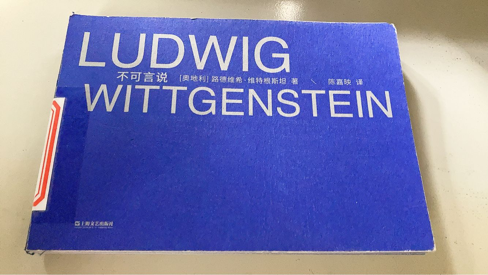
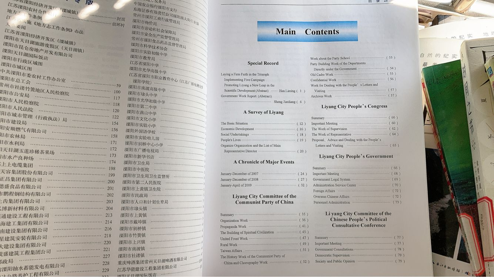

甲辰年 甲戌月 戊申日

晴

两区的每日都做过了。国区还是昨晚预判的。

茶叶盒叫我别刷别的，hr 看不懂。这帮食伤生财的人也就这点眼界了，死在钱眼里了能不能有点追求。戊戌己亥庚子年我要是没刷一堆洛谷只会比现在更菜。

抽代启动。

{K{UB94RASQ]KU`G_W.png>)

看到式子写错了才发现下载了没校对的书稿，蚌埠住了。等有钱了一定买一屋子纸质书。

去图书馆，几乎把每一本书都扫了一遍。烂书还是太多了，好书还是太少了。“你们媒体本身也要判断”。文史一坨，大学水平及以上的数学书一本没有，计算机好书一本没有，烂书倒是卷帙浩繁。看上去很新的实战机器学习，落后时代二十年。

所以才有了什么啊？如来拈花，迦叶微笑。

溧阳年鉴，整本就单独一个目录英语，真抽象。

报刊室怎么这么小了，我的科学世界都找不到了，快把启蒙老师还给我。鉴定为没人来看导致的。报刊室管理员大叔好多年了一直没换，每次见他都是到处踱步闲得发慌，这么好的又带薪又能自学的工作不想要赶紧给我。进少儿室，管理员大姨直接赶我走，这里是小学生看的。总体观感，乏善可陈，除了加了个插电自习室。

网友不要得寸进尺，视频都没仔细看就搁那阴阳怪气，我已经很友善地在宽容你，你别给脸不要脸，再狗叫我要对你重拳出击了！查询之后发现 dirichlet product 是很邪教的叫法，而且和 convolution 是一回事，鉴定为国内翻译问题，你在那说啥部分和、狄利克雷乘积，话都说不明白，建议回炉重修无穷级数。

手痒又想打 lc 周赛了。上场搬家打的 T2 的 check 只要取 max 就行了，b 脑子不会。

线筛又忘了，至少学过两次，记忆力堪忧。明天再来吧家人们。