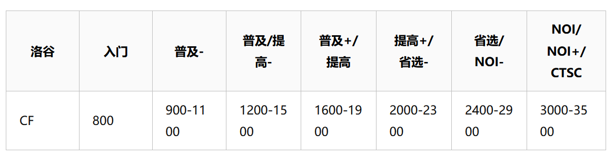

甲辰年 甲戌月 庚戌日

阴有小雨

国区每日找规律，题号 1884, 一发不难。美区题号 632. 难，归并加滑窗，想了四十分钟，难写，收藏一下下次再来吧家人们。

天目湖竟然比大溪近，初中估算错误。

周赛启动。



打了周赛，和操作数同场竞技！170 vs 59. 不敌，T4 寄，遗憾离场。

本来想去天目湖，懒了，下次再去吧家人们。

茶叶盒做不动了，什么二号 G.

找壬寅秋冬用的 pdf 笔记网站，忘了，收藏夹、google 账号都没。找 G 群资料文件名，原来 Kami.

玩点多线程。找个 extension 四倍速播放 plpl. 嫖电子书。

```
z 1倍速 x 减速 -0.1 c 加速 +0.1
` 1倍速 1 1.25倍速 2 1.5倍速 3 1.75倍速
4 2倍速 5 2.25倍速 6 2.5倍速 7 2.75倍速
8 3倍速 9 4倍速 0 5倍速
```

晚饭看土豆。

堀尾忠正竟然整了个装置可以不吃饭，神。

acwing 看了点算法。

中象，大优不会赢。

算法菜。

有生之年：

1. 省选实力，熟练过紫题，FT 预计 3 - 4y
2. 实变复变 + 抽代代拓 + 微分几何黎曼几何，基础不行可能补点数分线代，FT 预计 3 - 4y
3. 拿下三命卷四和滴天，FT 预计 4 - 5y

[补个数学书单子](https://blog.itdevwu.com/post/350/)
[培养方案](https://math.tsinghua.edu.cn/__local/6/33/97/E9CB10797F374B6624AF93E74E9_1D3042C6_3FCB5.pdf?e=.pdf)

癸酉壬申坏运的时候应该有机会搞。