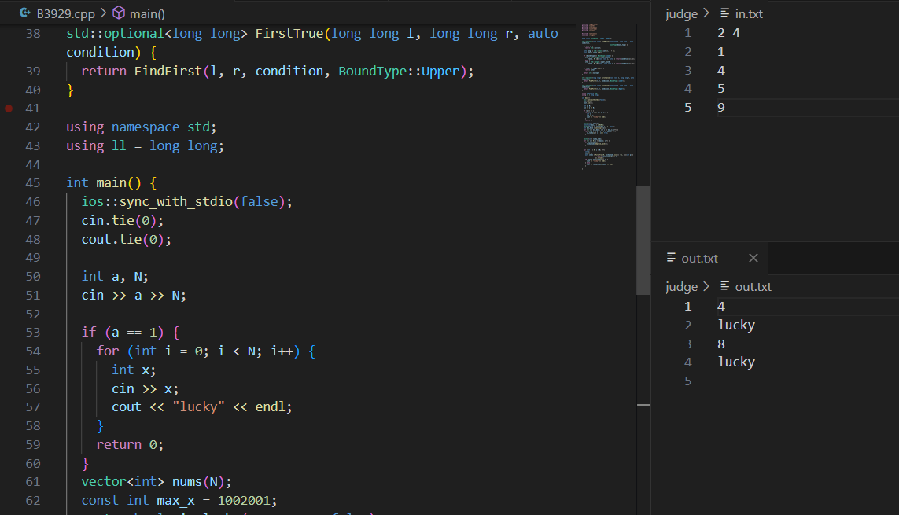

甲辰年 甲戌月 壬子日

阴、小雨、多云来回切换

好旺的水。

昨晚发现 github 对于有文件名包含特殊字符的图片怎么会 500 error. 写个 py 重命名一下，还得在 md 里改图片链接。怎么一堆细节，还得判后缀，还得判尖括号，api 不熟写了大半个上午，长码冠军。

国区每日上位 ez，写一下。美区好题，题号 2938，难度 1423. 枚举顺序反了，wa 了自造的测例。

搞一下输入输出混一起的问题。本来的打算，用 py 写个简单 gui，粘贴代码粘贴输入，存文件编译运行，重定向拿到输出再显示出来。发现 IDLE 竟然是自带的 tkinter 写的，试用。能编译出 exe，但发现一直 RE. 然后发现直接在 anaconda prompt 里运行 exe 都不行，错误码 3221225477，不懂，搜都搜不到。换 linux 机子一点问题没，但 win 用习惯了不想换成 linux 练算法。尝试改换实现思路。

仿操作数的 LLCG, 用脚本读取原有的 cpp，加上 fstream 头文件，替换掉 cin cout, 生成新的 cpp，然后提前准备好 in.txt, 编译运行就行了。

于是 cpp 先写完脚本，编译出 exe, 结合 vsc, 定义 task 和快捷键，实现一键替换并运行。

`.vscode` 里 `tasks.json` 开新的 task:
```json
{
    "label": "Redirect to FileIO and Run",
    "type": "shell",
    "command": "judge/rewrite.exe ${file} judge/redirected.cpp ; g++ judge/redirected.cpp -std=c++23 -O2 -o judge/redirected.exe ; cd ./judge ; ./redirected.exe",
    "group": {
        "kind": "build",
        "isDefault": true
    },
}
```

`Ctrl Shift P` 找 keyboard shortcuts, 新开快捷键：
```json
{
    "key": "ctrl+shift+3",
    "command": "workbench.action.tasks.runTask",
    "args": "Redirect to FileIO and Run"
}
```

vsc 竟然默认是 powershell 而不是 cmd. 连接两个命令要 `;` 不能 `&&`. 快捷键不冲突的找了半天。测了筛质数和昨天的橙题，分屏爽用，舒服了。



操作数谈论跑路。竟然付不起 n + 1 所以不裁员。至于找工作，这和裁员分析类似，写过了。