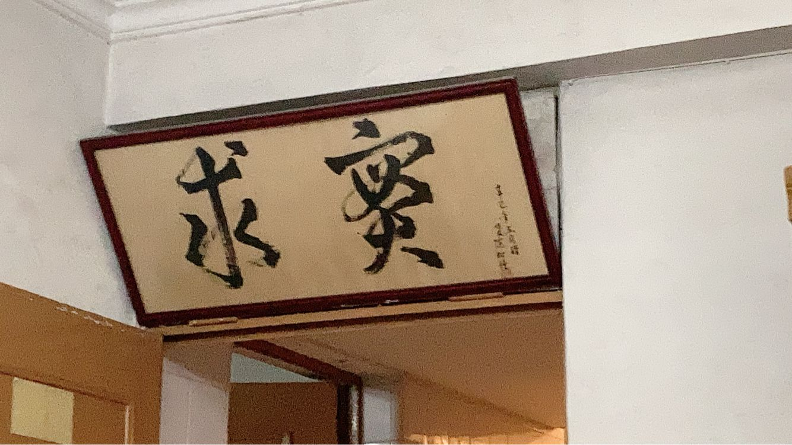

甲辰年 乙亥月 壬午日

上午：溧阳晴  
下午：上海阴有雨  

国区做过了，美区经典二分，操作数的谆谆教诲言犹在耳，一发过了。

耳机竟然还能用。

竟然随机到 xeraphinite. 黑y的 trance yyds

上午九点接电话，竟然今天下午三点就要住院。床位太紧导致的。

收东西，忘了耳塞。正要出发，老妈回来了。舅舅只能下午来，于是只能由我负责把两个 70+ 的老年人护送到上海肿瘤医院的病床上。出发时火车票都没下。

和老妈两人去三家村接两位老人，她眼疾手快建设路和燕山路十字路口看到空出租车就招手拦下了。

兵分两路，我去皮防站等车，等到了上车继续等。她去收拾东西接两位。等很久，司机催。

还得隐瞒她的胃癌。外公哄骗她微创。司机：小毛病，问题不大，我只能看车窗一言不发。

车票好了，先转杭州东，再虹桥。第一程，外公还在嘲讽姑外婆胃癌家人手术不及时，我又只能看车窗一言不发。他提到他年轻时的出差种种经历，以及多个老年朋友后辈的情况等。我只能随声附和。代入他本人，已经有点悲凉之感了。

杭州东。上楼吃番茄炒蛋面，三十六，卢本伟经典。附百事可乐，什么狗女人。

转虹桥。乱翻电子书。问他们想地铁还是出租车，回答后者。出站走出租车上车点，竟然是流水线作业。排队等车。上车告诉司机目的地，我不能明目张胆地把复旦大学附属肿瘤医院中的肿瘤二字说出来，以至于司机都不知道是哪个医院，我只能帮他在手机上手写输入。堵，五十分钟，问群，回答问题不大。

联系接头人，原以为是什么医生，结果竟然是中介。本来需要排队取号叫号，有了接头人之后直接插队到前台、电梯包厢。进住院大楼两个随从护送，过保安时，接头人说领导看病来了，保安毕恭毕敬地打开专属通道。

入院，量血压，护士竟然问有没有sexual life，真逆天。我问他们要不要送进病房的晚饭，他们不要。舅舅六点才能到。

病房坐一会儿，竟然有巡视保安赶我走，没有陪护证导致的，扫了要改舅舅麻烦。先撤了溜达溜达然后等他走了再回马枪杀回来。

时间还够，先去公费的民宿探路。好远，好简陋，上了楼还得开手电。钥匙在密码盒子里。烧水。竟然还有书法作品，一看竟然是辛巳年写的，之后癸巳，明年乙巳，马上二十四年了。放电脑，墙先翻起来。

歇一会儿时间不多了，返回，好长的红灯。走到医院门口对面，时间还多，吃晚饭。牛肉面，二十九，还行，就是牛肉有点少。口渴，把汤全喝了。

回门口等，还有十几分钟，去门诊找凳子，arc 启动，旁边大爷还凑过来看，嘴里上海话念叨玩的什么东西。

走。共享位置，wx还能这么玩，竟然门不一样。把红包给舅舅，他找另一个接头人，二号楼门口等。

去三号楼。这次没码不让进了，舅舅扫登记，我门口等，wyy + 随便翻点蓝书。他想让外公外婆去民宿住不要医院，但结果他们不肯，于是他先把睡袋给他们送去，再拖箱子回民宿。期间有女人问我借伞，我想给，但被舅舅拒绝，他的理由是女人很可能一去不回。

拖箱子雨中走，经典财破印。走了好久，他问我走路需要多久，我没有看时间，乱回答二三十分钟，他惊讶一千米这么久。途中他买了面包。他肠胃也不行，只有我能吃正常食物。也正常，他土相当弱。

缺保温桶送饭，去超市买。顺便筷子纸碗，油他可能有券，外卖。共享单车回来，竟然要钱，感觉不如永安行。

洗澡。和舅舅衣服扔洗衣机一起洗了。花洒力气好小。晒衣服。

上床乱翻蓝书，写日记。插座好少，没法爽写力扣了。竟然有人找我家教，可惜我预计十二月初就要离开中国了。

我剩余的任务应该不多了，明天再来吧家人们。